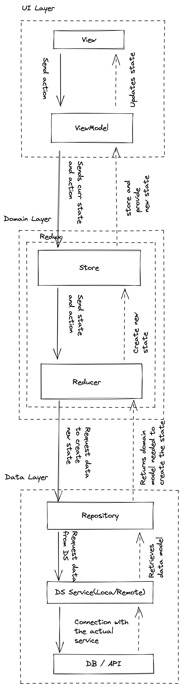

# Youtube Player
This app allows the user to search videos for an specified word in Youtube.

DISCLAIMER: The goal of this app is to play with MVI, Redux, modularization and its integration with.
UI isn't relevant for this purpose. I've used Hilt as Dependency Injection Framework. All arch 
layers except Screens, are unit tested with 100% coverage.

## Features:
 - Search Screen: User inputs a word, and sends the word to Videos Screen. Everytime a word is 
                  searched, it's stored in a Local SQLite DB for Cache using Room
 - VideosScreen: Grabs the word from Search Screen and search a list of videos using Youtube API.
                 To fetch the data is used Retrofit.

## Architectural overview
The main goal of this app is to experiment with MVI architectural pattern, so this Readme will focus
on the app's architecture. We are using an MVI with Redux as shown in the following Image. Data flow
is unidirectional and all components are separated by layers. The summarized flow is the following:
    - User sends an action from the view to the VM.
    - Redux generates new states working with Repositories and Data Sources if necessary, and updates
      the state in the ViewModel.
    - ViewModel updates view state and View recomposes to show the current state

Now we will explain every layer top to bottom (being bottom data and top UI). To have an 
unidirectional data flow, each top layer should only know about it's immediate bottom layer, but
bottom layer should know about any top layer. E.g: ViewModel contains a repository, but ViewModel
doesn't know about DS, and Repository doesn't know about ViewModel.

### UI Layer
UILayer focuses on UI Features only. This layer contains MainActivity, Compose Screens and ViewModels.

#### View
The View is responsible to show the UI to the user. It's created by a @Composble fun screen,
which contains components that conform the UI. View contains a ViewModel and listen to uiState stateFlow
which recomposes and updates the UI. View sends Actions to ViewModel to let lower level layers update
the uiState. In this project navigation between screens is handled using Compose Navigation.

#### ViewModel
ViewModel is responsible of handling coroutine scopes and sending the current state and action to redux, and update the uiState when
redux generates a new State. ViewModel contains a Store object, which provides new States based on 
current state and user actions.

### Domain Layer (Redux)
Domain Layer is responsible of handling UseCases. In this app we are sending actions, which could be
considered as UseCases. We use redux to abstract the state generation in order to make it more
decoupled and easier to test.

#### Store
Store is responsible to hold the current state and update it for the ViewModel. We do this through 
StateFlows. Store contains a reducer, which generates new states.

#### Reducer
Reducer is responsible of creating a new State when thea having a current state and an Action. 
Reducer could use repository to get DomainModel in case some DS data is needed.

### Data Layer
Is responsible to fetch Data from Either DataBase or remote API, and retrieve it to DomainLayer as 
DomainModels.

#### Repository
Repository contains a DataSource. Currently there is a data source for each repository, but a repository
could contain multiple data sources if needed. Repository gets the data provided by the data source and 
provides domain models to the domain layer.

#### DataSource
DataSource is an abstraction layer to call DB or API Methods. It's responsible of fetching data from 
remote or local storage and sen it to repository.

#### DB/API
DB and API layers are usually abstracted by using existing libraries. In this app we use Room for DB 
(Caching) and Retrofit for remote API.